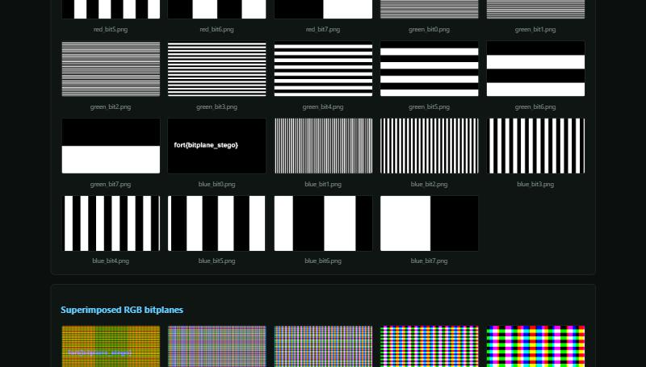

# strigano

Fast local triage for CTF stego and forensics. Point it at an image or an audio file and it runs the usual first-pass checks on one page, so you stop round-tripping Aperi'Solve and opening Audacity just to glance at a spectrogram.

I built it for CTFs. The goal is narrow: tell me in a few seconds whether a file is worth a closer look.

If it saves you time, a star is appreciated. Have fun.



## What it does

Images: every bitplane, superimposed planes, channel and grayscale views, appended-data carving, EXIF, strings, and it shells out to exiftool, binwalk, foremost, steghide and zsteg when you have them. It also OCRs the planes and flags anything matching your flag format.

Audio: the dual-channel spectrogram you normally open Audacity for, plus metadata and strings. WAV, FLAC and OGG work directly, MP3 goes through ffmpeg.

Whatever you do not have installed just gets skipped, so it still runs on a bare box.

## Running it

```
strigano serve        # local web app at http://127.0.0.1:8000
```

There is a CLI too if you want to script it:

```
strigano image chall.png
strigano audio chall.wav
strigano check        # which external tools are present
```

Output lands in `./strigano_output`.

## Install

Kali or Debian, full toolchain:

```
./scripts/setup-kali.sh
```

Docker, if you would rather not install anything:

```
docker build -t strigano . && docker run --rm -p 8000:8000 strigano
```

Windows works too (`pip install -e .`); you just lose the Linux-only tools until you add them.

## Try it

`examples/` has two files to poke at. `demo_image.png` hides a flag in the blue LSB, so check the blue_bit0 plane. `demo_spectro.wav` spells something in its spectrogram.

Set `STRIGANO_FLAG_PREFIXES=fort` so flag detection catches your event's format.

MIT licensed.
